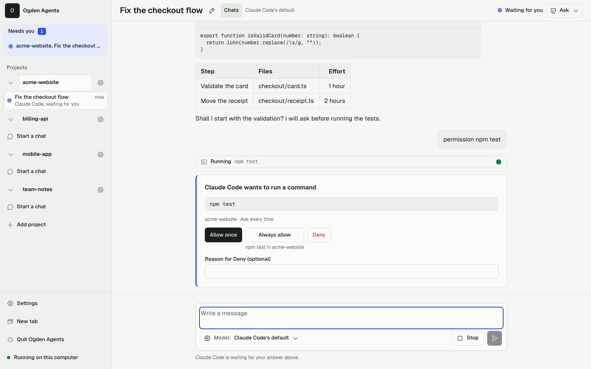

# Ogden Agents

[](https://github.com/hsmith-dev/ogden-agents/actions/workflows/ci.yml)

Ogden Agents is a local app, opened in your browser, for working with several AI coding agents at once without living in a terminal. In the spirit of herdr, it keeps many projects and many chats in one place and shows which are working, waiting for you or idle. It is made for simple users: each agent asks before it runs a command or edits a file, and you answer with a card. It wraps Claude Code, Antigravity, Codex and Grok through the Agent Client Protocol (ACP). It is open source (MIT) and free.



## Status

Early development, and honest about it:

- **There is no npm release yet.** The `ogden-agents` name on npm is only a placeholder, so `npx ogden-agents` does not give you the app today. Run it from a checkout (see [Requirements](#requirements) and [Run](#run)), or with the start scripts below once a release exists.
- **GitHub Releases come when a version tag exists.** Until then there is no release to download. Releases will be listed on the [releases page](https://github.com/hsmith-dev/ogden-agents/releases); how they are made is in [RELEASING.md](RELEASING.md).
- It has not had an outside security audit. One user on one computer is the design.
- Release notes are in [CHANGELOG.md](CHANGELOG.md).

## Requirements

- Node.js 24 or later
- pnpm 12
- At least one agent you can sign in to (Ogden can install them for you from Settings > Agents)

## Download

Ogden Agents is also a desktop app for macOS, Windows and Linux. It needs nothing else installed: no Node, no terminal. Download the file for your computer from the [latest release](https://github.com/hsmith-dev/ogden-agents/releases/latest) (versions marked as a prerelease are early builds for people on the next channel):

| Your computer | File |
| --- | --- |
| Mac, Apple silicon or Intel | `Ogden-Agents_<version>_universal.dmg` |
| Windows, most PCs (x64) | `Ogden-Agents_<version>_x64-setup.exe` |
| Windows on ARM (for example a Snapdragon laptop) | `Ogden-Agents_<version>_arm64-setup.exe` |
| Linux, most PCs (x64) | `Ogden-Agents_<version>_amd64.AppImage` (or `Ogden-Agents_<version>_amd64.deb`) |
| Linux on ARM (arm64) | `Ogden-Agents_<version>_aarch64.AppImage` (or `Ogden-Agents_<version>_arm64.deb`) |

Each release also has `SHA256SUMS-desktop.txt`, the checksum of every desktop file. The apps are **not signed yet**, so your computer warns the first time you open one. That is expected. How to open it:

**macOS.** Open the `.dmg`, drag Ogden Agents to Applications, then open it from Applications. macOS says it can't verify the app. Click Done (not Move to Trash), open System Settings, then Privacy & Security, scroll to the message about Ogden Agents and click **Open Anyway**, and enter your password. Open the app again and click Open. You do this once. macOS 13.5 or later is needed.

**Windows.** Run the installer. Windows SmartScreen says it protected your PC. Click **More info**, then **Run anyway**. The installer puts Ogden Agents in your own user folder and needs no administrator rights. It needs Microsoft's WebView2, which Windows 10 (since 2018) and Windows 11 already have; on an older PC the installer fetches it, so it needs an internet connection that one time.

**Linux.** Download the `.AppImage`, make it executable (right-click, Properties, Permissions, Allow executing as a program; or `chmod +x Ogden-Agents_*.AppImage`), then double-click it. Nothing is installed: it is one file you can keep anywhere your user can write, which is also what lets it update itself. An AppImage needs FUSE 2: on Ubuntu 22.04 and Debian it is already there, on Ubuntu 24.04 install `libfuse2t64`, on Fedora `fuse-libs`; without it run the file with `--appimage-extract-and-run` after its name. It needs a desktop with the WebKitGTK 4.1 library (Ubuntu 22.04 or Debian 12 and newer have it). If the window stays blank on Wayland or with some graphics drivers, start it as `GDK_BACKEND=x11 WEBKIT_DISABLE_COMPOSITING_MODE=1 ./Ogden-Agents_*.AppImage`. Inside a container or a restricted desktop, the sandbox setting is a browser matter: if the window never opens there, add `WEBKIT_DISABLE_SANDBOX_THIS_IS_DANGEROUS=1` only as a last resort. The `.deb` (`sudo apt install ./Ogden-Agents_*.deb`) installs through the package manager and is updated by downloading the newest `.deb`. Saved API keys go to your desktop's Secret Service (GNOME Keyring, KWallet) when there is one; with none, Ogden says so and does not save the key anywhere else.

The app checks for a newer version each time it starts, downloads it in the background and shows **Restart to update**. It never restarts while an agent is working. Quitting the app stops Ogden Agents and the agents it started. (An install by `.deb` does not update itself.) The npm route above still works, and both share the same data and projects.

## Start Ogden

These scripts need a published release. Until there is one, run from a checkout (see Run below). No terminal needed once there is one: download the start script for your computer, double-click it, and Ogden Agents opens in your browser. Download the scripts only from this project's [releases page](https://github.com/hsmith-dev/ogden-agents/releases/latest), where each release also lists their SHA-256 in `SHA256SUMS.txt`; they are also in this repository's [`start/`](start/) folder. The steps below tell your computer to run a script it can't verify, so never follow them for a "Start Ogden" file someone sent you.

First install **Node.js 24 or later** from [nodejs.org/en/download](https://nodejs.org/en/download) (the LTS version is fine). If it's missing or too old, the script tells you so, opens that page, and stops; it never installs anything itself and never asks for an administrator password.

**macOS.** Download `Start-Ogden-macOS.zip` and open it (Safari usually unzips it for you), then double-click **Start Ogden.command**. The script isn't signed by Apple, so the first time macOS refuses it ("unidentified developer", or "Apple could not verify…"):

- macOS 14 Sonoma and earlier: right-click (or Control-click) **Start Ogden.command**, choose **Open**, then **Open** again.
- macOS 15 Sequoia and later: click **Done**, open **System Settings > Privacy & Security**, scroll down to the message about Start Ogden.command, and click **Open Anyway**.

macOS remembers your answer. A Terminal window shows what's happening; you can close it once the browser opens.

**Windows.** Download `Start-Ogden.cmd` and double-click it. It needs no administrator rights and no PowerShell. If Windows shows "Windows protected your PC", click **More info**, then **Run anyway**. The window closes by itself once Ogden Agents opens.

**Linux.** Download `start-ogden.sh`, make it executable once, and run it in a terminal (if your file manager offers **Run in Terminal**, that works too; plain **Run** shows no window, so you wouldn't see an error):

```sh
chmod +x start-ogden.sh
./start-ogden.sh
```

`bash start-ogden.sh` works without the `chmod` too.

**What the script does.** It checks for Node.js, then runs `npx --yes ogden-agents@latest`: the first start downloads Ogden Agents (about a minute), and later starts check for a newer version. Ogden Agents keeps running in the background after the window closes; stop it with **Quit Ogden Agents** in the app, and double-click the script again to reopen it. If something fails, the window stays open with the reason. Options:

- Options after the script name go to Ogden Agents (for example `./start-ogden.sh --port 5000`). The Windows script refuses files and folders (a file dropped on it).
- `--check`, as the first option, only reports the Node.js, npm and package it found, and opens nothing.
- The script runs from your home folder, so npx never picks up settings or packages from the folder you downloaded it to.
- `OGDEN_AGENTS_DATA_DIR` keeps working (see Run). `OGDEN_AGENTS_PACKAGE` picks another package version, such as `ogden-agents@next`.
- **From GitHub Releases instead of npm.** `--github` (first option, or `OGDEN_AGENTS_SOURCE=github`) installs and updates from this project's [GitHub Releases](https://github.com/hsmith-dev/ogden-agents/releases): the script runs `ogden-install.mjs`, which must sit in the same folder as the script (the macOS zip already has it; download it from the same release for the others). It downloads `ogden-agents-<version>.tgz`, refuses to install it unless it matches `SHA256SUMS.txt`, installs it under your own user folder (never globally, no administrator rights), keeps the previous version for rollback, and updates on later starts. It works for a public repository; for a private one it needs `gh auth login` or `OGDEN_AGENTS_GITHUB_TOKEN`, and says so when it can't see the release. Details, channels and rollback: [RELEASING.md](RELEASING.md#installing-and-updating-from-github-releases).

## Agents and how they sign in

Each chat uses one coding agent: Claude Code, Google's Antigravity, OpenAI's Codex, xAI's Grok, or a **Local model**, which needs no account and no key: it talks to a server on your own computer (or any OpenAI compatible address you add) through OpenCode. In Settings > Agents, install it, then use a preset, press Detect (it looks only at this computer's usual ports, only when you press it) or add any address; another host needs your confirmation and warns about plain http. The Local model asks before every command or file change and offers Ask only. The harness it runs through makes no connection except to the server you set up (nothing leaves your computer for a server on it), though a command or web fetch you approve can reach further, and a server on your computer can itself forward elsewhere. Its chats are stored in plain text in the data folder. Small local models follow tool instructions less reliably than hosted ones. **Claude Code and Antigravity can sign in with your own subscription account.** **Codex and Grok are API-key only.** Codex uses your own OpenAI API key; signing in with a ChatGPT account isn't supported, because OpenAI's terms don't allow other apps to use subscription sign in. Grok uses your own xAI API access token; signing in with an account isn't supported here. A key or token is kept in your computer's keychain and goes only to its own agent's process. Settings > Agents installs an agent into Ogden Agents' data folder and takes its key or token. Grok runs a project's own settings, hooks and MCP servers, so a Grok chat starts only in a project you trusted.

| Agent | Sign in | Modes | Needs the project trusted |
| --- | --- | --- | --- |
| Claude Code | Your account, or an Anthropic API key | Ask, Auto, Skip all | No |
| Antigravity | Your Google account, or a Gemini API key | Ask, Skip all | No |
| Codex | An OpenAI API key only | Ask, Skip all | No |
| Grok | An xAI API access token only | Ask, Skip all (fixed when the chat starts) | Yes |
| Local model | No account and no key (a server's own key is optional) | Ask only | No |

Skip all is behind Developer mode.

### Terminals (Developer mode)

With Developer mode on, each project has a **Terminals** tab: a workspace of real terminals, in tabs and splits, for people who already use the agents' own command line programs. It is off for everyone else and never needed (the chat does the same work with cards). Open a plain shell, or start Claude Code, Codex, Grok, Antigravity or Copilot (Gemini only if you already have it). Ogden Agents only looks for these programs, with their `--version`, when you open the page or press **Detect**; it never installs one, and you sign in inside each program yourself: Ogden Agents never sees or keeps that sign in. A terminal gets a small, secret free environment (your proxy settings and SSH keys only if you turn them on in Settings > Terminals), and a project can have 8 terminals open at once, Ogden Agents 16. Each terminal shows a guess of what it is doing (working, idle, may need you, ended), a guess from what it prints, never a promise. Turn on **Notify me** for a terminal, or for a whole program in Settings > Terminals, to get the same sound or notice as chats when it may need you; it shows the project and the terminal's name, never what it printed. Your layout, names and opt ins are kept across a restart (what a terminal printed never is); after a restart each terminal shows as stopped with **Start**, and the programs end when Ogden Agents stops. Copilot is offered for your own interactive use only. Turning Developer mode off with terminals running asks whether to stop them or keep them running until Ogden Agents stops.

## Run

```sh
pnpm install
pnpm start            # builds, starts the server on 127.0.0.1, opens the browser
```

The page shows the connection state and lists logged events (currently one `server.started` per server start). Events persist across restarts, and a reloaded or reconnected page catches up from the last event it saw.

Ogden Agents keeps its SQLite database (`ogden-agents.db`), logs (`logs/server.log`), port file (`server.json`) and launcher token (`launcher.token`) in your OS per-user data folder under `ogden-agents/` (for example `~/Library/Application Support/ogden-agents` on macOS). Set `OGDEN_AGENTS_DATA_DIR` to use another folder. Nothing is written into your repos.

To change the database schema, edit `packages/core/src/db/schema.ts`, run `pnpm --filter @ogden-agents/core db:generate`, and commit the new migration in `packages/core/drizzle/`.

Launcher options (after `pnpm build`):

```sh
node bin/ogden.js --no-open     # print the URL and one-time link only; don't open a browser
node bin/ogden.js --port 5000   # a new server tries this port first
node bin/ogden.js --foreground  # run the server in this terminal (Ctrl+C stops it), for development
```

By default the launcher starts the server as a background process and exits, so the server keeps running after you close the terminal; its output goes to `logs/server.log` in the data folder. Running the launcher again finds that server (through `server.json` and the launcher handshake) and opens it with a fresh one-time link. Stop it with **Quit Ogden Agents** in the app's sidebar footer (it confirms first, and names any agents still working). Only one server runs per data folder (`server.lock`); a second one, such as `--foreground` beside a background server, refuses to start. If an older version is running and no session is busy, the launcher restarts it on the new version; if sessions are busy, it opens the running version and the update applies on a later launch once they finish. The page shows a reload banner when the server's version differs from its own.

The server binds only to `127.0.0.1`. It tries port 4317 first and moves to the next free port if that one is busy; the URL it prints is the one in use.

## Security

To report a vulnerability, see [SECURITY.md](SECURITY.md). For a plain-language tour of what the app can do to your computer, see [docs/share/security-and-privacy.md](docs/share/security-and-privacy.md). No telemetry or analytics code was found in the source (the method is on that page).

Ogden Agents is for one user on one machine, and it keeps other web pages and local processes out:

- **Loopback only.** The server listens only on `127.0.0.1`; there is no remote access and no HTTPS. It answers only requests addressed to `127.0.0.1:<port>` or `localhost:<port>`, which blocks DNS rebinding.
- **Launch link.** The launcher opens the browser at a one-time link (`http://127.0.0.1:<port>/#c=<code>`) and also prints it, so you can click it if no browser opened. The code works once, within 60 seconds.
- **Per-tab token, no cookie.** The page removes the code from the address bar at once and exchanges it, in a same-origin `POST`, for a random token for that one browser tab, held only in the server's memory. The token arrives in the response body and is kept in the tab's `sessionStorage`; it never appears in any URL, so it isn't in your browser history or autocomplete. Every API request sends it as `Authorization: Bearer`, and the WebSocket sends it as a subprotocol. Other local web servers never see it: unlike a cookie, it isn't sent to other ports on `127.0.0.1`.
  - Reloading a tab keeps it connected. A new tab, a bookmark or a copied URL has no token and shows **Open Ogden Agents**, with the command to run; **New tab** in the sidebar footer opens another connected tab.
  - Tokens end when the server stops (Quit, a restart, a reboot) or after 12 hours unused; a tab that stays open and connected keeps its token. After a restart, open the app again with `npx ogden-agents`.
  - WebSocket connections and requests that change state must also come from the app's own page (a matching `Origin`).
- **Content-Security-Policy.** The app runs only its own scripts: no inline script and no third-party origins.
- **Files in the data folder**, both readable only by you:
  - `server.json` holds the running server's `port`, `pid`, `version` and `startedAt`. It is written when the server starts and removed when it stops.
  - `launcher.token` is a random secret the server creates on every start and removes when it stops. The launcher sends it to reach the handshake (`/launcher/…`), which reports the server's version and issues launch links; it opens nothing else, and no tab token opens the handshake.

Launch codes, tab tokens and the launcher token never appear in the logs or the event log; the `Authorization` and `Sec-WebSocket-Protocol` headers are redacted.

**Known limit.** On a computer shared by several accounts, another local user can see the launch link (with its one-time code) on the process command line while your browser opens it (macOS, and Linux without `hidepid`), and could race to use it first. The code works once and only for 60 seconds; Ogden Agents is meant for one user per install.

## More

- [docs/share](docs/share/README.md): a plain-language kit for sharing Ogden Agents with coworkers (what it is, a FAQ, a one-page summary, a demo script).
- [CONTRIBUTING.md](CONTRIBUTING.md) and [CODE_OF_CONDUCT.md](CODE_OF_CONDUCT.md) if you want to help.

## Develop

Coding agents (and people) working in this repo: read [AGENTS.md](AGENTS.md) first for conventions and known pitfalls.

```sh
pnpm typecheck   # tsc across every package, the launcher and the tests
pnpm test        # builds, then Vitest: architecture, packaging, design-token, launcher and server tests
pnpm e2e         # builds, then Playwright (Chromium): shell layout at 1440/900/390, theme, density, per-tab token, launch state, CSP
pnpm build       # tsdown bundles packages/server, Vite builds packages/web, both copied into dist/
pnpm run pack    # builds, then writes the publishable tarball ogden-agents-<version>.tgz
pnpm smoke       # installs that tarball with npx in an empty temp dir and checks it serves the page
pnpm e2e:installed  # installs that tarball the same way and drives Chromium through it (see below)
```

**End-to-end against the installed package.** `pnpm e2e:installed` tests what a user gets, not the workspace. It installs `ogden-agents-<version>.tgz` (run `pnpm run pack` first; set `E2E_INSTALLED_TARBALL` to use another tarball) with npx in an empty temp folder. It starts the package through its own `ogden` launcher in background mode, with a temp data folder. It then drives Chromium through epic 1's journey: launch, the launch link, the shell, theme and density, Settings > Tools (status only, nothing is downloaded), New tab, a bookmark-style tab, and Quit. Before the journey it runs the security gate's negative checks: no tab token, a foreign Origin or Host, and the launcher endpoint without its token. It also runs them through a test-only proxy that takes the gate out of the way, where every check must fail, so the checks really detect a weakened gate. At the end no server process is left and the temp folders are removed. Screenshots and traces of failures go to `test-results/e2e-installed/`. It needs Chromium for Playwright (`pnpm exec playwright install chromium`).

```sh
pnpm run pack && pnpm e2e:installed
```

The root `ogden-agents` package is the only publishable artifact. `pnpm build` writes a self-contained `dist/` (`dist/server.js`, the server with every `@ogden-agents/*` package bundled in, and `dist/web/`, the UI), and `bin/ogden.js` loads it by relative path. Third-party runtime dependencies are declared in the root `dependencies`; `tests/packaging.test.ts` fails if the bundle imports anything undeclared or the tarball picks up workspace sources.

CI runs typecheck, tests, pack and the clean-install smoke test on macOS, Windows and Linux, each on Node 24 and 26, plus the Playwright browser tests on Linux Chromium, and the end-to-end suite against the installed package on macOS, Windows and Linux (Node 24, Chromium).

Releases are published to npm only by GitHub Actions, from a version tag on `main`, after the same CI passes; see [RELEASING.md](https://github.com/hsmith-dev/ogden-agents/blob/main/RELEASING.md).

## Layout

The monorepo follows the hexagonal layout in the architecture (AD-1). `tests/architecture.test.ts` fails if a package declares a dependency outside these edges.

| Path | Role | May depend on |
| --- | --- | --- |
| `bin/ogden.js` | Launcher | `server` |
| `packages/server` | Delivery: HTTP and WebSocket, wiring | `core`, `adapters`, `shared` |
| `packages/adapters` | Agent, OS, sandbox and tool adapters | `core`, `shared` |
| `packages/core` | Domain, ports, event log | `shared` |
| `packages/web` | React UI | `shared` |
| `packages/shared` | Zod schemas and types (the contract) | nothing internal |
