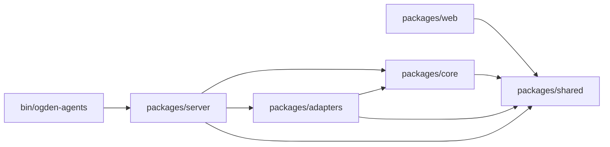
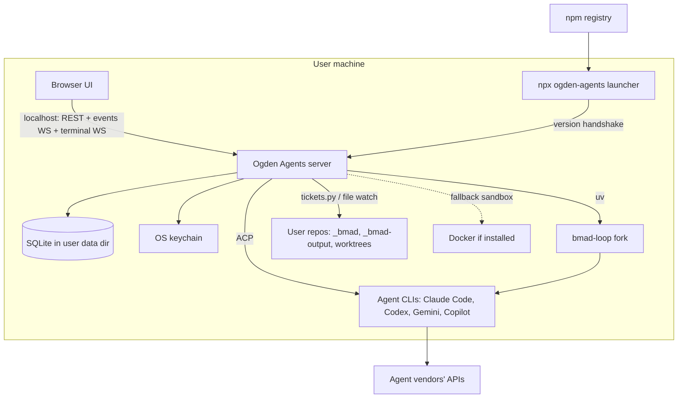
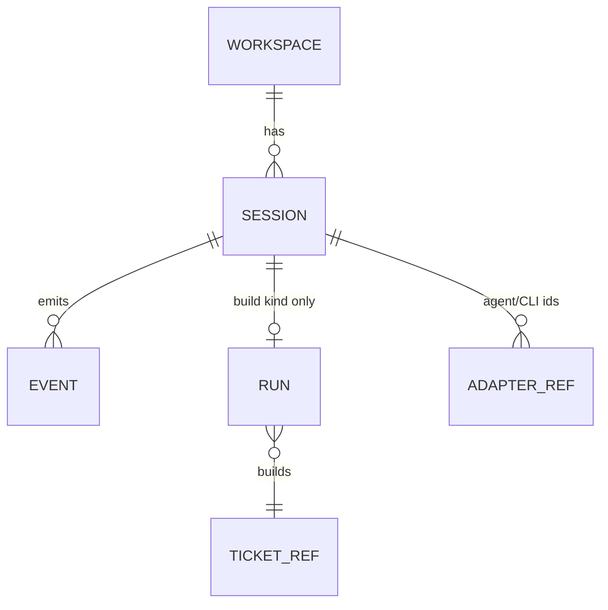

# Architecture Spine — Ogden Agents

## Design Paradigm

The architecture is hexagonal. `packages/core` holds the domain: workspaces, sessions, runs, approvals, the event log, and the ports. Everything that names a specific agent, OS, sandbox or tool is an adapter in `packages/adapters`, and `packages/server` wires adapters to ports. State reaches the UI only through the core's append-only event log.

| Layer | Package | Holds |
|---|---|---|
| Domain | `packages/core` | Entities, ports, event log, session and run state machines, verification rules |
| Adapters | `packages/adapters` | `acp-*`, `buildrunner-bmad-loop`, `tickets-v7`, `bmad-catalog`, `sandbox-*`, `vcs-git`, `terminal-pty`, `secrets-keyring`, `notify-*` |
| Delivery | `packages/server` | HTTP and WebSocket, the security gate, wiring, the launcher handshake |
| UI | `packages/web` | React app; `packages/web/ui` is the design system |
| Contract | `packages/shared` | Zod schemas and TypeScript types for every event, API shape and ID |
| Entry | `bin/ogden-agents` | `npx` launcher |

## Invariants & Rules



### AD-1 — Hexagonal core [ADOPTED]

- **Binds:** all
- **Prevents:** agent-, OS- or tool-specific branches spreading through the domain as epics 2, 5 and 6 add agents and sandboxes.
- **Rule:**
  - Dependencies follow the diagram above.
  - `packages/core` imports only `packages/shared` and names no agent, OS, sandbox, CLI or BMAD skill.
  - Each external concern sits behind a core port: `AgentPort`, `BuildRunnerPort`, `TicketStorePort`, `BmadCatalogPort`, `SandboxPort`, `VcsPort`, `TerminalPort`, `SecretStorePort`, `NotifierPort`.
  - Adding an agent or sandbox means adding an adapter, never a change to core.
  - `packages/web` never imports `core`, `adapters` or `server`.

### AD-2 — Workspace is the top-level scope

- **Binds:** CAP-2, CAP-3, CAP-7, CAP-8, CAP-17
- **Prevents:** sessions, runs or boards leaking across projects, or epics disagreeing on what a "project" is.
- **Rule:**
  - A workspace is exactly one repo root path, unique per install. The path is stored as its canonical real path, case-folded on case-insensitive filesystems, so a symlink or a different casing can't create a second workspace for the same repo.
  - Every session, run and event carries exactly one `workspaceId`.
  - Any number of workspaces may be active at once.
  - The unattended-run concurrency limit applies per workspace and globally, and both are enforced in core.

### AD-3 — The server owns agent processes

- **Binds:** CAP-3, CAP-5, CAP-8
- **Prevents:** work stopping when a browser tab closes, and two epics disagreeing about who starts or stops agents.
- **Rule:**
  - Only the server spawns and stops agent processes. The UI attaches and detaches through the event log and never controls a process directly.
  - `npx ogden-agents` starts a detached server if none is running. The server runs until Quit in the UI, or a reboot.
  - When the server starts, any session whose process is gone becomes `idle` and is marked resumable.

### AD-4 — One normalized session state

- **Binds:** CAP-3, CAP-9, CAP-15, CAP-17
- **Prevents:** each agent adapter inventing its own status words for the UI.
- **Rule:**
  - A session's state is exactly one of `working`, `waiting`, `idle`, `done`, `error`. `waiting` means waiting on the user, such as a permission card or a question.
  - Adapters map agent-specific signals to these states, and the UI reads only this field.

### AD-5 — One append-only event log is the only path to the UI [ADOPTED]

- **Binds:** CAP-3, CAP-4, CAP-5, CAP-7, CAP-9, CAP-12
- **Prevents:** a separate push mechanism per epic, and the UI coupling to agent-native output.
- **Rule:**
  - Every state change the UI shows is an event persisted by core in SQLite, with the envelope `{ id, seq, workspaceId, streamId, type, at, payload }`. `workspaceId` is `null` only for install-level events (such as `server.started`) that belong to no workspace.
  - `seq` increases strictly across the install.
  - The UI holds one WebSocket and subscribes with "after seq N"; reconnecting and catching up are the same call.
  - Every event type has a Zod schema in `packages/shared`, and nothing unschematized is emitted.
  - Every adapter that produces agent activity, whether an ACP chat or the bmad-loop build runner, emits the same `session.*` event types, so one session view renders both.
  - All events are retained, and history is deletable per workspace.
  - When a message completes, core appends a `session.message_completed` event carrying the full content. Its chunk events are pruned only after that, and the UI replaces chunks with the completed message.

### AD-6 — Terminal bytes use their own channel [ADOPTED]

- **Binds:** CAP-5
- **Prevents:** terminal output flooding the event log, and the chat and the terminal both driving one session.
- **Rule:**
  - Terminal I/O streams over a separate WebSocket per session and is never logged.
  - Each session has one `driver` (`ui` or `terminal`), which only core changes, and each change emits `session.driver_changed`.
  - While `driver = terminal`, core rejects chat input for that session.

### AD-7 — Board data is fetched; ticket events only invalidate [ADOPTED]

- **Binds:** CAP-7
- **Prevents:** ticket status being carried or cached in two places.
- **Rule:**
  - The UI reads tickets over REST with TanStack Query.
  - `ticket.*` events carry only `workspaceId` and a ticket ref, never status or content, and exist only to trigger refetch.

### AD-8 — Entity model [ADOPTED]

- **Binds:** CAP-3, CAP-8, CAP-9, CAP-12
- **Prevents:** chats and builds becoming two separate models with two live views.
- **Rule:**
  - The hierarchy is Workspace, then Session, then Event. A session's `kind` is `chat`, `planning` or `build`.
  - A Run exists only on a `build` session and holds the ticket ref, worktree path, sandbox used, deadline and `outcome`. `outcome` is exactly one of `running`, `verified`, `failed`, `blocked`, `stopped`.
  - Session state, run outcome and ticket status are three separate things. Ticket status comes only from `TicketStorePort`, and the UI never works out one from another.
  - The live run view is the session view in read-only mode.
  - Ogden Agents records no cost or token usage.

### AD-9 — Ogden Agents owns identity [ADOPTED]

- **Binds:** all
- **Prevents:** keys breaking when an agent changes its session ID scheme, and collisions between agents.
- **Rule:**
  - Primary keys are prefixed ULIDs: `ws_`, `ses_`, `run_`, `evt_`.
  - Agent session IDs and CLI resume IDs are stored as adapter refs on the session and are never used as keys or in URLs.

### AD-10 — Ticket state lives only in the BMAD files [ADOPTED]

- **Binds:** CAP-7, CAP-8, CAP-12
- **Prevents:** the database and the plan files disagreeing about a ticket.
- **Rule:**
  - The database stores ticket refs only.
  - Reads go through `TicketStorePort`: an index rebuilt from file watching, which can be thrown away at any time.
  - For a ticket with an active run, the port reads its plan from that run's worktree; otherwise it reads the main checkout. The watcher never scans worktrees.
  - Every status change goes through `tickets.py mark`, via that port.
  - `done` is written only by the approve action.

### AD-11 — Only core writes the database [ADOPTED]

- **Binds:** all
- **Prevents:** adapters or routes writing rows that bypass events and invariants.
- **Rule:**
  - Adapters return values or emit into core through ports, and never hold a database handle.
  - Routes call core use-cases and never write directly.

### AD-12 — BMAD is discovered, not hard-coded

- **Binds:** CAP-2, CAP-6, CAP-15, CAP-18
- **Prevents:** Ogden Agents code changing per skill, and drift from upstream modules.
- **Rule:**
  - `BmadCatalogPort` builds the catalog of modules, skills, agents and help from installed metadata (`bmod.toml`, `SKILL.md` frontmatter, `roster.toml`, help files).
  - The UI renders every action from that catalog.
  - Skill names appear only inside the adapters that must invoke a specific skill (`buildrunner-bmad-loop` for `bmad-build-auto`, `tickets-v7` for `tickets.py`).
  - Plain-language labels live in fork metadata.

### AD-13 — Forks are bundled and locked [ADOPTED]

- **Binds:** CAP-2, CAP-8
- **Prevents:** epics 4 and 5 running against different fork versions.
- **Rule:**
  - Each Ogden Agents release bundles its BMAD-METHOD and bmad-loop forks inside the npm package. Skills are copied into repos from the package, and bmad-loop is installed by `uv` from a bundled wheel.
  - `forks.lock` names the fork tags, and CI fails if the bundled files differ from it.
  - Each fork keeps an `upstream` mirror branch and an `ogden-agents` branch made of upstream plus one patch per upstream PR, tagged `v<upstream>-ogden-agents.<n>`.
  - A patch is removed once upstream merges it.

### AD-14 — Reduced mode on upstream BMAD [ADOPTED]

- **Binds:** CAP-2, CAP-6, CAP-7
- **Prevents:** Ogden Agents breaking repos that already have plain upstream BMAD.
- **Rule:**
  - Features are gated on capabilities detected from installed metadata, not on version strings.
  - A feature whose fork capability is missing is shown as unavailable, with an upgrade offer. It never fails silently.

### AD-15 — One security gate [ADOPTED]

- **Binds:** all
- **Prevents:** an epic adding an endpoint without protection, leaving it open to cross-site requests, DNS rebinding, or another local web server replaying a loopback cookie.
- **Rule:**
  - The server binds only to `127.0.0.1`.
  - Every HTTP and WebSocket request passes one middleware that checks, in order:
    1. `Host` exactly `127.0.0.1:<port>` or `localhost:<port>`, otherwise 403.
    2. The launcher opens `/#c=<launch code>`. The page's boot script sends the single-use launch code, valid for 60 seconds, in a same-origin `POST /api/tab/exchange` (Host and Origin checked, no token needed). The response body carries a new random per-tab token (256 bits, held in server memory until Quit, restart, or 12 hours unused). The token never appears in any URL. No cookie is set. (Renegotiated by the user, 2026-09-30, after the security review found `/#t=<token>` recorded in browser history.)
    3. Static app files (the built UI) are served without a token; they contain no user data. Only the static handler and the SPA shell serve paths outside `/api`, `/ws` and `/launcher`, and a test enumerates the registered routes to keep it so.
    4. Every API request needs `Authorization: Bearer <tab token>`. Every WebSocket upgrade needs the subprotocols `ogden.v1` and `ogden.auth.<token>`, and the server echoes only `ogden.v1`. The subprotocol counts only on a real upgrade (`Connection: upgrade`) to `/ws`; every other request needs Bearer. Otherwise 401.
    5. WebSocket upgrades and every method other than GET, HEAD and OPTIONS also need a matching `Origin`, otherwise 403.
    6. `/launcher/*` is reachable only with the launcher token (unchanged).
  - No route is registered outside the gate. Tokens and codes never appear in logs or events, and the `Sec-WebSocket-Protocol` and `Authorization` headers are redacted. The app sends a Content-Security-Policy that allows only its own scripts: no inline script and no third-party origins.
  - The launcher finds the server through a port file in the user data directory, readable only by the user.
  - Note (story 1.7): the launcher token is 256 random bits the server writes to `launcher.token` in the data directory on each start (readable only by the user, removed on stop), sent in a request header and compared in constant time. It opens nothing but the handshake, and no tab token opens the handshake.
  - Note (story 2.1, amending story 1.4's cookie): browsers send cookies for `127.0.0.1` to every port on it, so the session cookie and its signing key `auth.key` are retired; a leftover `auth.key` is deleted at start and old cookies are ignored. The page's boot script (a same-origin file, not inline) strips `#c=` from the URL with `history.replaceState`, exchanges the code, and keeps the token in memory and `sessionStorage`, so a reload keeps the tab connected, while a new tab or a bookmark has no token and shows the app's own "Open Ogden Agents" state. New tab in the sidebar footer asks `POST /api/launch-codes` (token and Origin required) for a fresh launch link.
  - Known limit: on a computer shared by several accounts, another local user can see the launch URL (with its single-use code) on the process command line while the browser opens it (macOS; Linux without `hidepid`) and race to redeem it. Mitigated by 60-second single-use codes; an install is for one user.

### AD-16 — Secrets [ADOPTED]

- **Binds:** CAP-16
- **Prevents:** credentials leaking into the database, the event log or logs.
- **Rule:**
  - Subscription logins stay in each agent's own CLI, and Ogden Agents never reads or stores them.
  - API keys go through `SecretStorePort`: the OS keychain (`@napi-rs/keyring`), falling back to an encrypted file readable only by the user where no keychain exists.
  - Adapters redact secrets before emitting events.

### AD-17 — Unattended runs are contained

- **Binds:** CAP-8, CAP-10, CAP-12
- **Prevents:** a run touching another ticket's files, running unsandboxed, running forever, or reaching `done` without a person.
- **Rule:**
  - Each run gets its own git worktree through `VcsPort`, created in the user data directory, never inside the repo.
  - `SandboxPort` tries, in order: the agent's native sandbox on this OS, then Docker if it is already installed. If neither is available, the run is refused with the choices shown.
  - Every run has a maximum wall-clock duration, after which core stops it and marks it blocked.
  - After a run, core runs verification before the UI may show `built`: plan status, an independent test re-run, and a non-empty diff.
  - Merging and `done` happen only through the approve action. If the merge conflicts, the run is blocked as needing a rebase. It is never force-merged.

### AD-18 — One design system [ADOPTED]

- **Binds:** all UI
- **Prevents:** each epic styling its own screens and the app reading as a generic AI app.
- **Rule:**
  - shadcn/ui components live, owned and restyled, only in `packages/web/ui`. There is no second component library, and feature code does no ad hoc styling.
  - Color, type, spacing, radius and motion are CSS-variable tokens with light and dark sets, and components use tokens only.
  - The visual direction comes from the `design-taste-frontend` Design Read, recorded by `bmad-ux` as `DESIGN.md` and `EXPERIENCE.md` in epic 1.
  - The status sidebar, workspace switcher and session view are built once and reused.

### AD-19 — The terminal is optional to load [ADOPTED]

- **Binds:** CAP-1, CAP-5
- **Prevents:** one native module breaking `npx ogden-agents`.
- **Rule:**
  - `terminal-pty` is loaded lazily.
  - If `node-pty` fails to load, Ogden Agents runs with the terminal toggle disabled and the reason shown.

### AD-20 — Launcher and server version handshake [ADOPTED]

- **Binds:** CAP-1
- **Prevents:** an update killing agents mid-work, or a new UI talking to an old server.
- **Rule:**
  - The launcher asks the running server for its version.
  - If the server is older and idle (no active runs or sessions), the launcher asks it to restart and it restarts automatically, then the launcher starts the new version. If any session is busy, the older server keeps running and is opened as it is; the launcher never stops running sessions itself.
  - If an open tab's UI is older than the server it talks to (a newer server was found by an older open tab), the page shows a non-blocking reload banner. The server does not reject UI assets from another version.
  - Note (epic 1 retrospective, 2026-09-30): amended in place to match what story 1.7 built; the earlier text said the launcher *offers* a restart and the server rejects UI assets from another version.

### AD-21 — No standard flow requires a terminal

- **Binds:** all
- **Prevents:** an epic shipping instructions like "run X in a terminal", for example to install `uv` or an agent CLI, or to sign in.
- **Rule:**
  - Every CLI step a standard flow needs, including installing `uv`, installing or signing into agent CLIs, running BMAD setup, and applying a saved patch, is run by the server and shown in the UI with progress and errors.
  - The terminal toggle (AD-6) is only for advanced users and is never required.

## Consistency Conventions

| Concern | Convention |
| --- | --- |
| Event types | `domain.snake_case_past_or_noun`: `session.message_delta`, `session.state_changed`, `permission.requested`, `run.verified`, `ticket.changed` |
| IDs | Prefixed ULID strings (AD-9); ticket refs as BMAD writes them (`2.3`) |
| Time | ISO 8601 UTC strings in every payload and API |
| API | REST under `/api/v1`, scoped by workspace: `/api/v1/workspaces/:wsId/…` |
| Errors | `{ "error": { "code": "snake_case", "message": "…", "details"?: {} } }`; codes live in `packages/shared` |
| Adapter naming | `<port>-<variant>`: `acp-claude-code`, `sandbox-seatbelt`, `notify-webhook` |
| Files | kebab-case; one exported React component per file, except shadcn-style compound components in `packages/web/src/ui` (for example `sidebar.tsx` exporting `Sidebar`, `SidebarGroup`, …), which keep their parts together |
| Config and data | The OS per-user data directory `ogden-agents/` holds the SQLite database, logs and the encrypted-secrets fallback. Nothing is written to user repos except BMAD's own files and worktrees |
| Logging | Structured JSON lines to the data directory; secrets redacted (AD-16) |
| Tests | Every ticket ships its tests; UI layout is checked in a real browser with Playwright, since jsdom doesn't evaluate media queries |

## Stack

| Name | Version |
| --- | --- |
| Node.js | ≥ 24 (LTS 24.21, 26.8) |
| pnpm (workspaces) | 12.8 |
| TypeScript | 7.0 |
| Zod | 4.6 |
| Hono + @hono/node-server | 4.13 / 2.1 |
| ws | 8.22 |
| better-sqlite3 + drizzle-orm (`better-sqlite3` driver) | 13.0 / 0.45 |
| @agentclientprotocol/sdk | 1.5 |
| node-pty + @xterm/xterm | 1.1 / 6.0 |
| @napi-rs/keyring | 2.1 |
| React | 19.3 |
| Vite | 8.3 |
| @tanstack/react-router / react-query | 1.170 / 5.104 |
| Tailwind CSS | 4.3 |
| shadcn (CLI) | 4.21 |
| Vitest / @playwright/test | 5.0 / 1.63 |
| uv (BMAD Python tooling) | ≥ 0.12, installed by Ogden Agents if missing |

## Structural Seed





```text
ogden-agents/
  bin/ogden-agents            # launcher: start or attach server, open browser, handshake
  packages/shared/        # Zod schemas: events, API, ids, error codes
  packages/core/          # domain, ports, event log, state machines, verification
  packages/adapters/      # acp-*, buildrunner-bmad-loop, tickets-v7, bmad-catalog, sandbox-*, vcs-git, terminal-pty, secrets-keyring, notify-*
  packages/server/        # Hono app, security gate, WS channels, wiring
  packages/web/           # React app; ui/ = design system
  vendor/                 # bundled forks per forks.lock
  forks.lock
  _bmad-output/           # Ogden Agents's own spec, architecture, tickets
```

Delivery: GitHub Actions runs the tests on macOS, Windows and Linux for every change, and a clean `npx ogden-agents` install on each OS for Node 24 and 26, because `better-sqlite3` is a native module the app can't run without, and a tagged release publishes one `ogden-agents` package to npm. There are no hosted environments. Each install runs one local environment, and Ogden Agents sends no telemetry.

## Capability → Architecture Map

| Capability / Area | Lives in | Governed by |
| --- | --- | --- |
| CAP-1 install and launch | `bin/ogden-agents`, `server` | AD-3, AD-19, AD-20, AD-21 |
| CAP-2 set up BMAD in a repo | `bmad-catalog` adapter | AD-12, AD-13, AD-14 |
| CAP-3 persistent chats | `core` sessions, `acp-*` | AD-3, AD-4, AD-5, AD-8, AD-9 |
| CAP-4 permission cards | `acp-*` → `permission.*` events | AD-4, AD-5 |
| CAP-5 terminal toggle | `terminal-pty`, core driver lock | AD-6, AD-19 |
| CAP-6 guided planning | catalog-driven UI, planning sessions | AD-12, AD-18 |
| CAP-7 board | `tickets-v7`, TanStack Query | AD-7, AD-10 |
| CAP-8 unattended builds | `buildrunner-bmad-loop`, `vcs-git`, `sandbox-*` | AD-2, AD-17 |
| CAP-9 live run view | session view (read-only) | AD-5, AD-8 |
| CAP-10 verification | core | AD-17 |
| CAP-11 | retired (no cost tracking) | AD-8 |
| CAP-12 review and approve | core approve action, `vcs-git` | AD-10, AD-17 |
| CAP-13 retrospectives | catalog-driven planning session | AD-12 |
| CAP-14 notifications | `notify-*` | AD-1 |
| CAP-15 every agent | `acp-*`, bmad-loop profiles | AD-1, AD-4 |
| CAP-16 sign-in | `acp-*` authenticate, `secrets-keyring` | AD-16, AD-21 |
| CAP-17 workspaces and status sidebar | core, shared UI patterns | AD-2, AD-3, AD-4, AD-18 |
| CAP-18 every BMAD skill and module | `bmad-catalog` adapter | AD-12, AD-14 |

## Deferred

- **Visual direction:** decided in epic 1 by `bmad-ux` with `design-taste-frontend`. AD-18 fixes only the mechanism.
- **Default concurrency limits and maximum run time:** tuned in epic 5. AD-2 and AD-17 fix only that the limits exist and that core enforces them.
- **Where the CAP-5 toggle appears for each agent:** measured in epic 3, recorded in the spec's `agent-matrix.md`.
- **Notification transports beyond webhook:** decided in epic 5 behind `NotifierPort`.
- **Start at login, a tray icon, or a desktop wrapper:** later, and neither breaks AD-3.
- **Tracker stores, remote access, and several users per install:** out of scope (spec non-goals).
- **Logging library and Drizzle migration tooling:** epic 1, within the Conventions.
- **Merge-conflict handling beyond blocking as needing a rebase:** epic 5.
