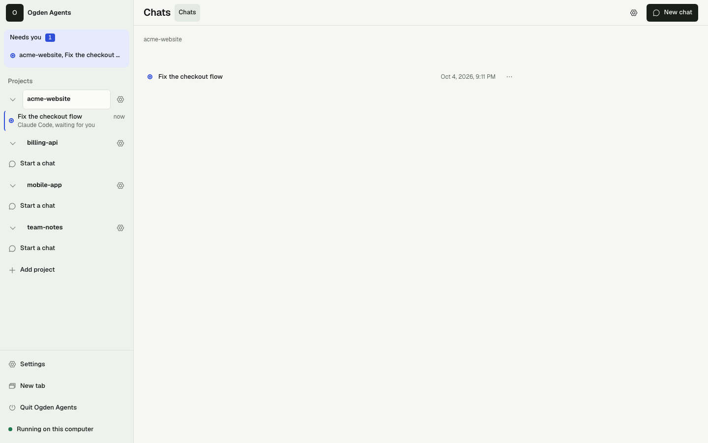
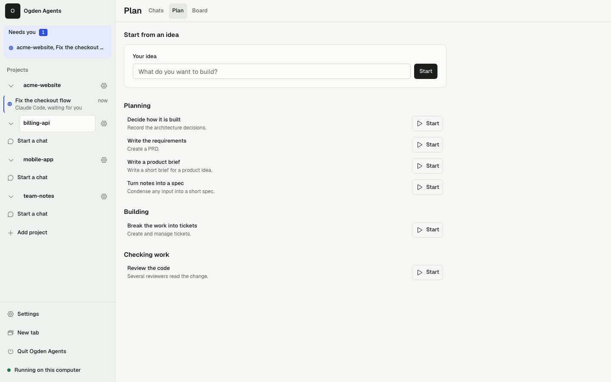
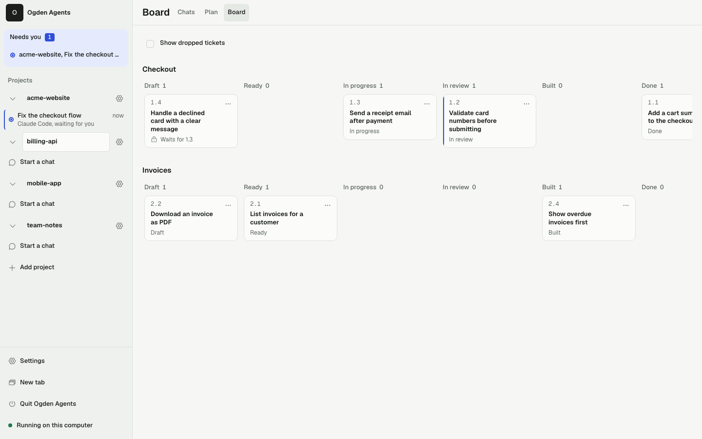

# Ogden Agents: sharing kit

This folder is for sharing Ogden Agents with coworkers. Read this page first; the rest is linked at the bottom.


## What it is

Ogden Agents is a free, MIT-licensed local app for working with AI coding agents across projects. It opens in your browser or the desktop shell. It runs on your computer, with no Ogden cloud account.

Claude Code and Antigravity can use their own account sign-in or an API key. Codex uses an OpenAI API key; Grok uses an xAI API token. A local model uses your configured OpenAI-compatible endpoint and needs no provider account. Messages and files reach the provider or endpoint you choose.

## Who it is for

People who want coding agents without living in a terminal, and developers who need one place to coordinate projects, chats and work that needs their answer. Each installation is for one person on one computer.

## What is implemented

- Persistent chats, formatted replies, tool calls, permission cards, models, drafts, queued messages and a cross-project Needs you view.
- A preview you can edit before continuing a conversation with another agent.
- Optional BMad Planning, a live ticket Board, Retrospectives and lessons for later builds.
- Ticket builds in separate worktrees, verification results, review and approval before merging. Claude Code can build unattended with a supported sandbox; Codex, Grok and Antigravity currently build with you watching. Local model builds are not offered.
- Manager/worker orchestration with approval per instruction by default, dispatch limits, activity records and Stop.
- Ogden, Forest and Ember appearance presets, custom paired light/dark themes with contrast validation and JSON import/export, density controls and responsive layout.
- Native terminal tabs and splits in Developer mode.
- Desktop packaging and double-click start scripts for macOS, Windows and Linux.

## Release status and limits

Implementation is ahead of the old sharing-kit screenshots. This page describes the source tree, and does not claim that npm v1 has been published. [v1 readiness](../v1-readiness.md) lists automated and live evidence still required. App signing is outside this release's scope; unsigned-app opening instructions are in the [main README](../../README.md#download).

Codex unattended builds remain disabled until its sandbox passes real-machine checks. Grok and Antigravity builds require you to watch. A full editor-style diff browser and a VS Code extension remain v2 candidates. External security auditing has not been completed.

## How to run it today

From a checkout, install Node.js 24 or later and pnpm 12:

```sh
git clone https://github.com/hsmith-dev/ogden-agents.git
cd ogden-agents
pnpm install --frozen-lockfile
pnpm start
```

Welcome helps set up an agent in Ogden's data folder. If the browser does not open, use the printed one-time link within 60 seconds. Stop the app with **Quit Ogden Agents** in the sidebar.

Once the release is published and verified, use `npx ogden-agents@0.1.0`, the release's start scripts or a desktop download. See [the main README](../../README.md) for installation instructions.

## Support and custom work

Ogden is free to use, with no donation required. For AI workflows, custom software and integrations for your business, visit [HarrisonSmith.AI](https://harrisonsmith.ai). To support Harrison's open-source work, [buy a coffee on Venmo](https://venmo.com/u/harrismith).

## Try it safely

Point it at a copy of a project, or a scratch folder, for the first session. Leave the permission mode on Ask. Nothing the agent asks to do runs until you click a card.

## The rest of the kit

| File | For |
| --- | --- |
| [one-page.md](one-page.md) | The pitch, to forward |
| [demo-script.md](demo-script.md) | A 5-minute and a 15-minute live demo |
| [security-and-privacy.md](security-and-privacy.md) | For the security-minded coworker |
| [faq.md](faq.md) | Cost, accounts, platforms, terms, offline |
| [screenshots/](screenshots/) | Every key screen in light and dark, desktop and phone |

To regenerate the screenshots after the UI changes, see the last section of [demo-script.md](demo-script.md).

## Gallery

| Projects and the sidebar | Plan | Board |
| --- | --- | --- |
|  |  |  |

The screenshots show demo data on a fake agent. They are for illustration, not a record of a real session.
